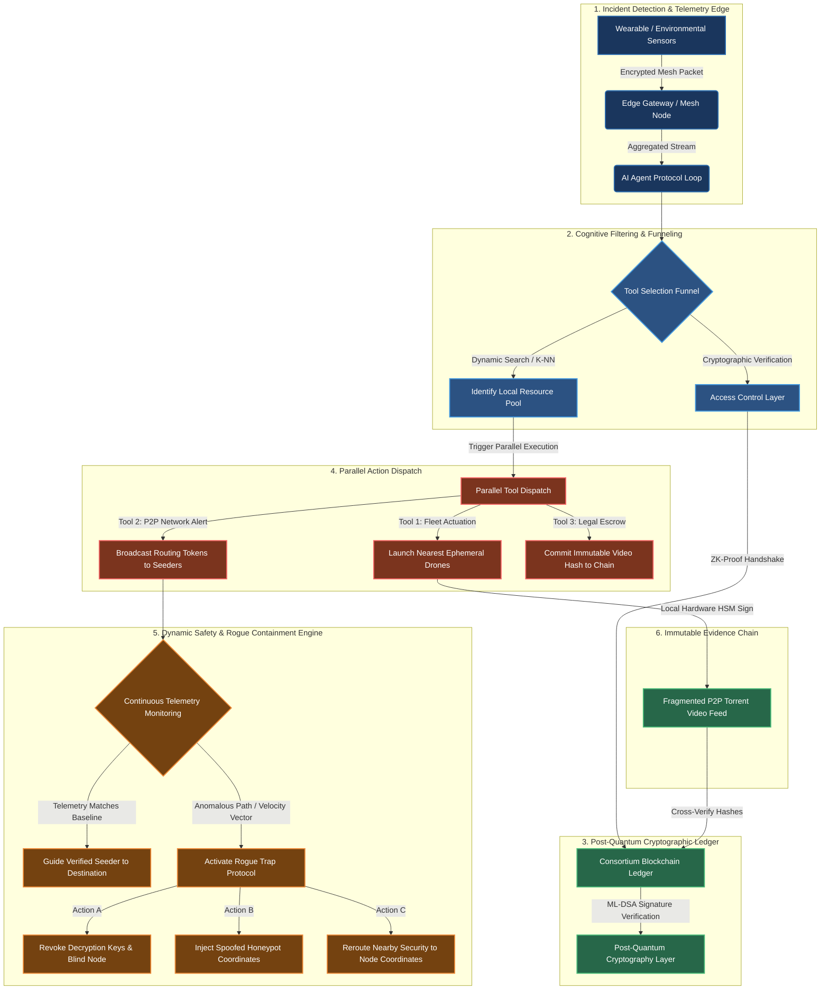

# CivicShield: Open-Source Post-Quantum Sovereign Security Mesh

CivicShield is an open-source safety infrastructure project for protecting vulnerable people in public spaces without turning safety into surveillance. It combines privacy-preserving geofencing, cryptographically verified community responders, AI-assisted incident orchestration, autonomous drone support, and tamper-evident evidence handling.

In simple terms, CivicShield aims to answer a hard question: **how do we get help to the right place in seconds, prove who can be trusted, and preserve evidence, without exposing everyone’s live location to a central system?**

This project is intended to be useful across three audiences:
- **Builders and open-source contributors** who want a concrete, modular architecture to implement.
- **Hackathon teams and researchers** who need a strong problem statement plus a realistic MVP path.
- **Civic, NGO, and mission-aligned funders** who care about safety, privacy, resilience, and long-term societal trust.

---

## Executive Summary

Today’s public safety tools often force a trade-off between speed, trust, and privacy:
- Fast systems are often invasive.
- Privacy-preserving systems are often too passive.
- Community response systems are often difficult to verify.
- Evidence pipelines are often weak or easy to dispute.

CivicShield is designed to close that gap with a layered implementation model:
- **Detect incidents at the edge** through wearables, panic signals, or local sensor events.
- **Localize the response** using H3 hexagonal geofencing instead of persistent exact-position tracking.
- **Verify nearby responders** with cryptographic identity and zero-knowledge proofs of eligibility.
- **Dispatch in parallel** across responder networks, drones, and evidence systems.
- **Continuously screen for adversaries** using telemetry-based anomaly detection and rogue-node trapping.
- **Preserve evidence integrity** using signed capture flows and ledger-anchored hashes.
- **Future-proof trust** with post-quantum signatures for identities, routing privileges, and evidence manifests.

---

## Why CivicShield Exists

Public safety systems for vulnerable people often fail in exactly the moments where speed, trust, and privacy matter most. CivicShield is designed to address those gaps with an open, implementable architecture that can evolve from hackathon prototype to real-world pilot.

### Problems We Are Solving

#### 1. Slow emergency response in the first critical minutes
In many assault, stalking, abduction, harassment, or medical-risk situations, traditional escalation paths depend on manual reporting, overloaded hotlines, or centralized dispatch systems that are too slow for dynamic street-level events.

**CivicShield response:** detect incidents at the edge, classify urgency in real time, and dispatch the nearest verified responders and autonomous assets within the affected safety zone.

#### 2. Safety systems that require invasive continuous tracking
Many current solutions improve safety only by collecting permanent location trails, centralizing identity data, or maintaining long-lived user profiles that can themselves become surveillance liabilities.

**CivicShield response:** use H3 geofenced regions, short-lived routing leases, and zero-knowledge location proofs so the system can coordinate help without exposing exact responder or victim positions to the full network.

#### 3. Lack of trusted local responders near the incident
A centralized safety network is only useful if qualified help can actually reach the scene quickly. In many cases, official responders are too far away, and community assistance lacks verification, coordination, and secure routing.

**CivicShield response:** maintain a cryptographically verified local responder mesh of vetted Seeders who can prove eligibility and proximity without revealing unnecessary personal data.

#### 4. Risk of adversaries infiltrating the response network
Bad actors may attempt to pose as helpers, intercept routes, or exploit emergency coordination channels to locate targets.

**CivicShield response:** continuously verify responder telemetry, score route anomalies, revoke compromised access, and trap suspicious nodes with honeypot routing while redirecting legitimate enforcement assets.

#### 5. Fragile or disputable evidence after an incident
Critical visual and telemetry evidence is often lost, altered, deleted, or challenged later due to weak chain-of-custody controls.

**CivicShield response:** sign evidence close to the point of capture, fragment it across resilient networks, and commit tamper-evident hashes to a ledger for verifiable judicial or administrative review.

#### 6. Future cryptographic exposure of safety infrastructure
Long-lived safety and identity data protected only by classical cryptography may become vulnerable to future quantum-capable attacks.

**CivicShield response:** adopt post-quantum signatures for device identity, responder authorization, and evidence integrity so the platform remains defensible as cryptographic threats evolve.

---

## How We Implement the Solution

CivicShield is designed as a concrete, modular system that can be implemented incrementally. The architecture is intentionally open so teams can build one layer at a time, test it in constrained pilots, and extend it without redesigning the whole stack.

### Implementation Principles

- **Privacy by default:** do not centralize precise location unless absolutely necessary.
- **Locality first:** route incidents and resources only within relevant geofenced areas.
- **Cryptographic trust:** verify identities, permissions, and evidence with strong signatures and proofs.
- **Parallel response:** coordinate people, machines, and audit systems concurrently.
- **Graceful degradation:** preserve core safety workflows even when some assets are unavailable.
- **Open modularity:** allow independent teams to build firmware, backend, privacy, drone, and ledger modules in parallel.

### End-to-End Operational Flow

1. **Detect the incident at the edge**  
   Wearables, panic devices, environmental sensors, or nearby edge nodes emit encrypted telemetry when a distress pattern or emergency trigger is detected.

2. **Aggregate and classify the event**  
   A local mesh gateway forwards the telemetry to the AI agent protocol loop, which determines severity, selects the appropriate tools, and computes the affected geofence.

3. **Identify eligible nearby resources**  
   The platform maps the event into H3 cells and searches only the active cell and neighbor rings for relevant responders, devices, drones, and support assets.

4. **Preserve privacy during responder matching**  
   Seeder devices validate locally whether they are inside the target zone. If eligible, they generate a zero-knowledge proof of proximity and authorization rather than exposing exact coordinates.

5. **Authorize and dispatch in parallel**  
   Once verified, the system concurrently issues routing instructions to Seeders, launches nearby drone assets, and records the evidence pipeline.

6. **Continuously validate responder behavior**  
   During the response, the platform checks signed movement vectors, route coherence, and anomaly scores to detect impersonation, deviation, or malicious interception.

7. **Trap malicious nodes and protect the victim**  
   If a responder becomes suspicious, CivicShield revokes leases, blinds sensitive data, injects decoy routing, and escalates real location intelligence to legitimate enforcement channels.

8. **Create a durable evidence chain**  
   Drone or edge-captured media is hardware-signed, fragmented for resilience, and anchored to a consortium ledger so later verification can prove authenticity and chain of custody.

---

## 🛠️ Complete System Architecture

The ecosystem spans from physical hardware tokens up to decentralized ledger networks. The diagram below illustrates the structural dataflow from localized physical detection to post-quantum validation and multi-threaded defensive dispatch.



---

## 🚀 Core Architectural Pillars

### 1. Decentralized Spatial Hexagonal Geofencing
To eliminate heavy database operations and continuous location monitoring, CivicShield segments the physical map into discrete hexagonal grids using Uber's H3 Spatial Indexing System. Devices communicate their presence as anonymized Resolution 9 H3 cell IDs instead of precise coordinates. Emergencies are routed only to the active cell and its neighboring rings, keeping coordination localized, fast, and privacy-preserving.

**Implementation approach:**
- Use [`spatial.py`](server/app/spatial.py) to translate GPS coordinates into H3 cell IDs.
- Limit search, dispatch, and routing to local geofence rings (`k=1`, `k=2`).
- Store only short-lived region references for active incidents instead of persistent movement histories.

### 2. Geographic Zero-Knowledge Privacy
To prevent the safety network from becoming a tracking grid, responder positions are hidden using geographic zero-knowledge proofs.

**Implementation approach:**
- Seeder devices listen locally for encrypted emergency broadcasts.
- Each device performs on-device matching against the target H3 zone.
- Eligible responders generate a proof equivalent to: *"I am an authorized responder in the target geofence"* without revealing exact coordinates.
- [`security.py`](server/app/security.py) validates the proof and issues an ephemeral routing lease.

### 3. Kinematic Trajectory Filtering & Rogue Traps
If a malicious entity infiltrates the network pretending to be a verified Seeder, the gateway continuously screens real-time telemetry.

**Implementation approach:**
- Responders periodically submit signed heading, velocity, and route-state updates.
- The orchestration layer compares live motion against expected path envelopes and anomaly thresholds.
- If a node deviates materially, the platform revokes access, blinds sensitive context, serves decoy coordinates, and alerts legitimate security assets.

### 4. Post-Quantum Cryptography and Ledger Layer
All device registries, identity profiles, and cryptographic states are secured using post-quantum signatures over a consortium ledger.

**Implementation approach:**
- Use ML-DSA-based signing for responder identity, device attestation, and evidence manifests.
- Record verification events and content hashes on a consortium ledger for tamper evidence.
- Separate fast operational decisions from durable audit anchoring so the system remains responsive under load.

### 5. AI Agent Orchestration for Multi-Tool Response
Real incidents require concurrent decisions across matching, authorization, drone dispatch, and evidence capture.

**Implementation approach:**
- [`main.py`](server/app/main.py) serves as the FastAPI ingestion and orchestration layer.
- The agent loop classifies the event, selects tools, and coordinates concurrent dispatch actions.
- The design supports asynchronous execution, retry policies, and policy-based routing for different incident classes.

### 6. Evidence Integrity by Design
Evidence collection is treated as a first-class system responsibility rather than a post-incident afterthought.

**Implementation approach:**
- Drones and edge devices sign media close to capture using hardware-backed keys where possible.
- Evidence is fragmented or replicated across resilient storage paths.
- Hashes are anchored to the ledger so any later modification can be detected immediately.

---

## MVP Implementation Path

For hackathons, pilots, or early contributor onboarding, the fastest credible MVP is:

1. **Panic trigger to incident intake**
   Accept a signed distress event from a mobile app, wearable, or simulated edge device.

2. **H3-based local matching**
   Convert the event location into an H3 cell and identify candidate responders only in the local ring.

3. **Responder verification**
   Verify responder credentials and issue a short-lived access token or proof-backed lease.

4. **Parallel dispatch**
   Notify responders, start a lightweight drone or camera workflow, and create an incident evidence record.

5. **Evidence anchoring**
   Hash media and event metadata, then anchor them to a tamper-evident audit store or ledger.

This MVP is enough to demonstrate the core CivicShield thesis: **fast response, local trust, privacy preservation, and verifiable evidence can coexist in one system.**

---

## Why This Matters to Contributors, Hackathons, and Backers

### For open-source contributors
- Clear module boundaries make it easy to contribute to one subsystem without owning the entire platform.
- The architecture invites work across backend, cryptography, spatial systems, embedded systems, drones, and product UX.
- The project has strong documentation potential around trust boundaries, threat modeling, and incident orchestration.

### For hackathon teams
- The idea has a strong narrative: protect vulnerable people without centralizing surveillance.
- It supports a realistic MVP in a short timeline: trigger, geofence, verify, dispatch, and anchor evidence.
- Teams can demo both technical novelty and social impact in one story.

### For investors, NGOs, and mission-aligned funders
- CivicShield targets a real trust gap in public safety infrastructure.
- It is designed to be extensible across campuses, cities, events, transit systems, and protected communities.
- Its defensibility comes from combining privacy-preserving coordination, cryptographic assurance, and multi-asset response orchestration.

---

## 📂 Repository Layout

```text
├── docs/
│   └── CivicShield_Architecture_Specification.pdf  # Comprehensive technical whitepaper
├── server/
│   ├── app/
│   │   ├── main.py          # FastAPI ingestion engine and orchestration layer
│   │   ├── spatial.py       # H3 geofencing and hex-cell operations
│   │   └── security.py      # Cryptographic verification and rogue-trap logic
│   └── requirements.txt     # Python dependencies
└── README.md
```

---

## 🛠️ Open-Source Implementation Roadmap

We are building this infrastructure in the open, with implementation split into concrete module tracks:

1. **`agent-brain` (Python/FastAPI):** Build the async ingestion engine, incident classifier, tool router, and concurrent dispatch workflow.
2. **`firmware-core` (C++/RTOS):** Develop panic tokens, wearable interfaces, mesh communication modules, and secure hardware identity anchors.
3. **`zk-privacy` (Circom/Rust):** Build zero-knowledge circuits and proof verification services for geographic eligibility checks.
4. **`pqc-trust` (Rust/Python):** Integrate ML-DSA signing, key lifecycle management, and attestation validation for devices and responders.
5. **`drone-response` (Python/ROS/Edge):** Implement autonomous drone tasking, scene capture orchestration, and signed evidence packaging.
6. **`evidence-ledger` (Go/Rust):** Anchor evidence manifests, verification events, and audit trails into the consortium ledger.

---

## Suggested Next Enhancements

To make the design stronger for GitHub readers, judges, contributors, and real-world stakeholders, the next documentation additions should include:

- **Threat model:** enumerate attacker classes such as stalkers, rogue responders, insider threats, and ledger-level adversaries.
- **Trust boundaries:** define what runs on device, at the edge gateway, in the orchestration layer, and on the ledger.
- **Failure modes:** explain degraded-mode behavior for poor connectivity, unavailable drones, false positives, and proof verification delays.
- **Metrics:** document target response latency, proof verification time, anomaly precision, and evidence finalization SLA.
- **Deployment views:** add separate diagrams for edge deployment, backend control plane, and evidence pipeline.
- **Policy model:** define how municipalities, NGOs, or campus operators configure escalation rules and responder eligibility.
- **Demo guide:** include a reproducible local demo that simulates an incident from trigger to evidence anchoring.

---

## Contributing

CivicShield is best suited for contributors interested in one or more of the following areas:
- FastAPI and distributed backend orchestration
- H3 geospatial routing and local search
- Zero-knowledge proof systems and verifier services
- Post-quantum cryptography and key lifecycle design
- Embedded or wearable safety devices
- Drone coordination and edge evidence capture
- Ledger anchoring and tamper-evident audit systems

A strong next step for the repository would be a contributor guide that defines module ownership, coding standards, test strategy, and an MVP milestone map.

---

## Vision

CivicShield is an ambitious open-source attempt to build safety infrastructure that does not depend on permanent surveillance, blind trust, or fragile evidence. The long-term goal is to make rapid, privacy-preserving, cryptographically verifiable protection deployable wherever vulnerable communities need it most.
