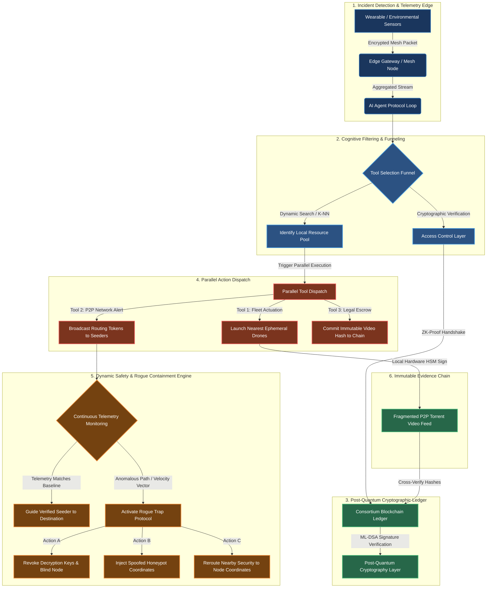

# CivicShield: Open-Source Post-Quantum Sovereign Security Mesh

CivicShield is an open-source, post-quantum, zero-trust cyber-physical safety network engineered to provide a sovereign protection layer for highly vulnerable individuals in public spaces without relying on continuous, centralized tracking. The system combines an event-driven AI Agent task loop, a decentralized peer-to-peer (P2P) volunteer responder network ("Seeders"), and an autonomous, ephemeral drone deployment framework to secure real-time physical environments.

Our operational mandate is absolute: **Decisively isolate and trap malicious actors, seamlessly mobilize vetted community responders, and preserve unerasable cryptographic visual evidence for judicial execution.**

---

## 🛠️ Complete System Architecture

The ecosystem spans from physical hardware tokens up to decentralized ledger networks. The diagram below illustrates the exact structural dataflow, from localized physical detection to post-quantum validation and multi-threaded defensive dispatch.



---

## 🚀 Core Architectural Pillars

### 1. Decentralized Spatial Hexagonal Geofencing
To eliminate heavy database operations and continuous location monitoring, CivicShield segments the physical map into discrete hexagonal grids using Uber's H3 Spatial Indexing System. Devices communicate their presence purely as anonymized Resolution 9 H3 cell IDs (covering roughly 0.1 km²). Emergencies are instantly routed and restricted to the active cell and its immediate neighboring rings ($k=1, 2$), keeping data localized, fast, and secure.

### 2. Geographic Zero-Knowledge Privacy
To prevent the safety network from turning into a tracking grid for adversaries, responder positions are hidden using **Geographic Zero-Knowledge Proofs (zk-SNARKs)**:
* **Passive Interception:** Seeder devices listen locally to the encrypted emergency broadcast.
* **On-Device Matching:** The local device checks its own GPS coordinate against the targeted H3 cell.
* **ZKP Handshake:** If a match occurs, it generates a mathematical proof stating: *"I am a verified, background-checked responder currently inside the designated crisis geofence, without revealing my exact coordinates or profile identity."*
* **Ephemeral Lease:** The central engine validates the proof and instantly issues a temporary, short-lived routing lease.

### 3. Kinematic Trajectory Filtering & Rogue Traps
If a malicious entity infiltrates the network pretending to be a verified Seeder, the gateway continuously screens real-time telemetry:
* **Trajectory Verification:** Responders stream periodic velocity and heading vectors signed via post-quantum keys.
* **Anomaly Triggers:** If a node deviates from its calculated path by more than 15° or reflects erratic telemetry, its anomaly score instantly breaches the tolerance threshold ($\tau$).
* **The Honeypot Lock:** The system silently forks the compromised node into an isolated virtual plane. It feeds the node realistic, dynamically generated fake tracking coordinates to isolate the threat, while simultaneously routing physical enforcement assets to the node's true location.

### 4. Post-Quantum Cryptography (PQC) & Ledger Layer
All device registries, identity profiles, and cryptographic states are secured using **ML-DSA** (NIST post-quantum cryptographic signature standards) over a high-throughput consortium ledger. This future-proofs critical municipal safety telemetry against advanced, state-level quantum decryption arrays.

---

## 📂 Repository Layout

```text
├── docs/
│   └── CivicShield_Architecture_Specification.pdf  # Comprehensive Technical Whitepaper
├── server/
│   ├── app/
│   │   ├── main.py          # FastAPI Ingestion Engine & Tool Router
│   │   ├── spatial.py       # Uber H3 Geofencing & Hex Operations
│   │   └── security.py      # Cryptographic Verification & Rogue Trapping Logic
│   └── requirements.txt     # Python Dependencies
└── README.md
```

## 🛠️ Open-Source Implementation Roadmap
We are building out this global infrastructure completely in the open. Module leads would work on the following tracks as a immediate step:
1. **`agent-brain` (Python/FastAPI):** Hardening high-concurrency async tool dispatch protocols and backoff error resilience matrices.
2. **`firmware-core` (C++/RTOS):** Microcontroller programming for physical, un-stealable biometric anchor tokens and local low-power mesh radios.
3. **`zk-privacy` (Circom/Rust):** Building and compiling arithmetic circuits for zero-knowledge proximity boundary verifications.
